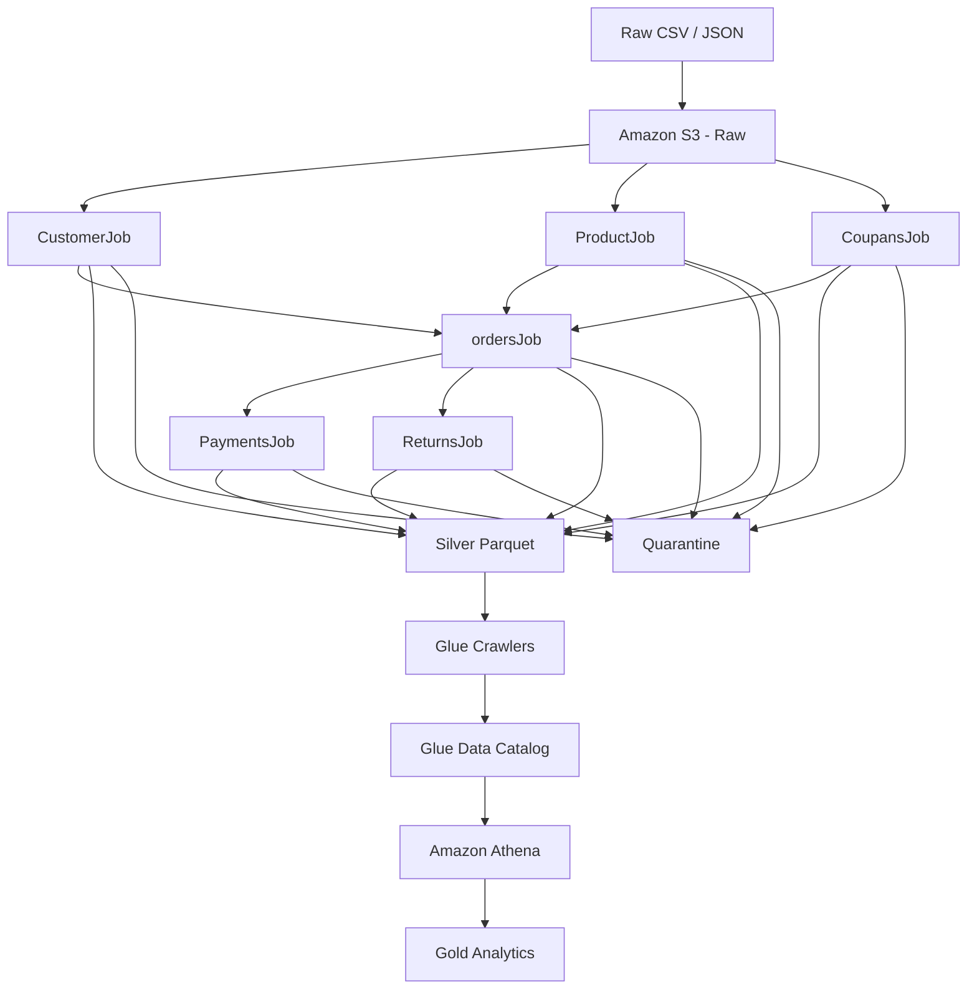

## RetailLake

An AWS-based retail data engineering pipeline built using Amazon S3, AWS Glue, Glue Data Catalog and Amazon Athena.
RetailLake processes raw retail datasets through a Raw → Silver → Gold architecture. The project focuses on data quality, incremental file ingestion, transformation, orchestration and analytical data preparation.


## Project Overview

I had previously worked with tools like Airflow and Docker, where I used multiple components and locally managed infrastructure.

With **RetailLake**, I wanted to understand how an end-to-end data engineering pipeline could be built mainly using AWS-managed services.

The project stores raw retail data in **Amazon S3**, processes it using **AWS Glue and PySpark**, stores cleaned data as **Parquet**, maintains metadata using **Glue Crawlers and Glue Data Catalog**, and uses **Amazon Athena** for querying and analytical data preparation.

The project focuses on data quality, incremental ingestion, transformation, orchestration, and analytical data preparation.


## Architecture



This reflects the workflow and AWS Glue handles the processing while Crawlers maintain the metadata needed by Athena.

## 3. AWS Services


## AWS Services

| AWS Service | How I Used It |
|---|---|
| **Amazon S3** | Stored Raw, Silver, Gold and Quarantine data |
| **AWS Glue** | Ran PySpark ETL jobs and orchestrated the pipeline |
| **Glue Data Catalog** | Stored metadata and table definitions |
| **Glue Crawlers** | Examined Silver Parquet data and updated the Catalog |
| **Glue Workflows** | Managed dependencies between Glue jobs |
| **Glue Job Bookmarks** | Enabled incremental file-level ingestion |
| **Amazon Athena** | Queried Silver/Gold data using SQL and validated results |
| **AWS IAM** | Controlled access between AWS services |


## Data Lake / Data Quality

RetailLake follows a **Raw → Silver → Gold** architecture with a separate **Quarantine** layer.

### Raw

Raw data is stored in its original form in:

`s3://retaillake-data/raw/`

### Silver

Silver contains validated and transformed data stored as **Parquet**.

The jobs perform:

- Null handling
- Duplicate detection
- Date validation
- Regex validation for fields such as email and phone
- Referential integrity checks
- Business-rule validation
- Data type conversion
- Derived columns and enrichment

Only records that pass the required validations are written to the valid Silver datasets.

### Quarantine

Invalid records are separated into:

`s3://retaillake-data/quarantine/`

Each quarantined record contains information such as `record_status` and `validation_reason`, so I can understand why a record failed instead of simply losing it.

### Gold

Gold contains prepared analytical datasets for commonly required business questions.

`s3://retaillake-data/gold/`


## Incremental Ingestion

I used **AWS Glue Job Bookmarks** to process newly added files incrementally instead of repeatedly processing the same previously processed files.

I tested this by:

1. Running the jobs on the existing Raw data.
2. Adding new files to the S3 input path.
3. Running the jobs again.
4. Verifying that the newly added input was processed.

This testing was performed across all six ingestion jobs.

### Limitation

Job Bookmarks provide **file-level incremental processing**, not row-level change detection.

If a later file contains a changed version of an existing business key, the current pipeline does not automatically update the previous Silver record. Cross-batch upserts are treated as a future enhancement.


## Workflow

The pipeline is orchestrated using an **AWS Glue Workflow**.

```text
CustomerJob ──┐
ProductJob  ──┼──► ordersJob ──┬──► PaymentsJob
CoupansJob  ──┘                └──► ReturnsJob

```
## Gold Analytics

The Gold layer contains six analytical datasets created from the validated Silver data.

| Gold Dataset | Purpose |
|---|---|
| `gold_sales` | Enriched order-level sales information |
| `gold_customer_analytics` | Customer ordering and purchasing behavior |
| `gold_product_analytics` | Product sales, revenue and return-related metrics |
| `gold_payment_analytics` | Payment methods, status and payment/order relationships |
| `gold_return_analytics` | Return frequency, reasons and customer-related patterns |
| `gold_coupon_analytics` | Coupon usage and sales associated with coupons |

The purpose of the Gold layer is to prepare commonly required analytical data so the same joins and aggregations do not have to be performed repeatedly on Silver.


## Key Challenges & Solutions

### Glue Job Bookmarks

The initial implementation used Spark's DataFrame reader, but the expected bookmark behavior was not obtained.

**Solution:** Changed the S3 ingestion to Glue DynamicFrames with `transformation_ctx` and tested incremental processing by adding new files.

### JSON with an Outer Array

Some JSON files contained an outer array of objects, which was not correctly interpreted by the initial DynamicFrame configuration.

**Solution:**

```python
format="json",
format_options={
    "multiline": True,
    "jsonPath": "$[*]"
}


```

## 9. Validation

```markdown
## Validation

The final Silver datasets were checked for:

- Row counts
- Null values
- Referential integrity
- Duplicate behavior
- Schema correctness
- Quarantine output
```

### Final Silver Counts

| Dataset | Records |
|---|---:|
| Customers | 1,897 |
| Products | 935 |
| Coupons | 187 |
| Orders | 5,746 |
| Payments | 4,612 |
| Returns | 1,162 |

The Gold datasets were also checked for data availability, key uniqueness, basic metric correctness, enrichment, sample records, and reconciliation against Silver where applicable.


## Limitations / Future Improvements

### Current Limitation

The current pipeline supports **incremental file-level ingestion**, but does not implement full cross-batch upsert semantics.

If a later file contains a changed version of an existing business key, the pipeline can process the new file but does not automatically update or replace the previous Silver record.

### Future Improvements

- Better configuration management instead of hardcoded S3 paths
- More consistent naming conventions
- S3 Versioning enabled from the beginning
- More automated batch-level testing and quality metrics
- Better schema-evolution handling
- Cross-batch upserts using Apache Iceberg
- More comprehensive monitoring and alerting
